# Java Threading Fundamentals

*A structured pass over the raw notes in [`Threads.md`](./Threads.md) — thread basics, memory layout, and the
core concurrency hazards, with diagrams and runnable code examples.*

> For the deep-dive (memory model, locks, executors, virtual threads, production playbook), see
> [`java-concurrency-and-thread-safety.md`](./java-concurrency-and-thread-safety.md). This document only
> covers the foundational material that was in `Threads.md`.

---

## Table of Contents

1. [Why Threads?](#1-why-threads)
2. [Processes vs. Threads](#2-processes-vs-threads)
3. [Context Switching](#3-context-switching)
4. [Creating Threads: `Runnable` vs. `Thread`](#4-creating-threads-runnable-vs-thread)
5. [Thread Termination and Interruption](#5-thread-termination-and-interruption)
6. [Daemon Threads](#6-daemon-threads)
7. [Thread Coordination: `join()`](#7-thread-coordination-join)
8. [Performance: Latency vs. Throughput](#8-performance-latency-vs-throughput)
9. [Memory Layout: Stack vs. Heap](#9-memory-layout-stack-vs-heap)
10. [Resource Sharing Between Threads](#10-resource-sharing-between-threads)
11. [Atomic Operations](#11-atomic-operations)
12. [Critical Sections and `synchronized`](#12-critical-sections-and-synchronized)
13. [Race Conditions vs. Data Races](#13-race-conditions-vs-data-races)
14. [Locking Strategy: Fine-Grained vs. Coarse-Grained](#14-locking-strategy-fine-grained-vs-coarse-grained)
15. [Deadlocks](#15-deadlocks)
16. [Cheat Sheet](#16-cheat-sheet)

---

## 1. Why Threads?

Two independent justifications, and it matters which one is driving the design:

| Goal | What it means | Example |
|---|---|---|
| **Responsiveness** | The app keeps reacting to input while other work happens | A UI thread stays interactive while a file downloads on a background thread |
| **Performance** | Total work finishes faster by using more CPU cores at once | Splitting an array sum across 4 threads on a 4-core machine |

```mermaid
gantt
    dateFormat  X
    axisFormat %s
    section Single-threaded
    Task A blocks everything      :a1, 0, 3
    Task B waits its turn         :a2, after a1, 3
    section Multi-threaded
    Task A runs in background     :b1, 0, 3
    Task B / UI stays responsive  :b2, 0, 3
```

Same total work, but the multi-threaded version keeps Task B making progress (or the UI responsive) instead
of stalling behind Task A.

**Concurrency ≈ multitasking**: multiple tasks make progress over the same time window. It does not require
multiple cores (that's *parallelism*) — a single core can interleave threads via context switching and still
give you concurrency.

---

## 2. Processes vs. Threads

A thread is a unit of execution that lives *inside* a process and shares that process's memory (heap, static
variables) with every other thread in it. What's private per-thread is small and specific:

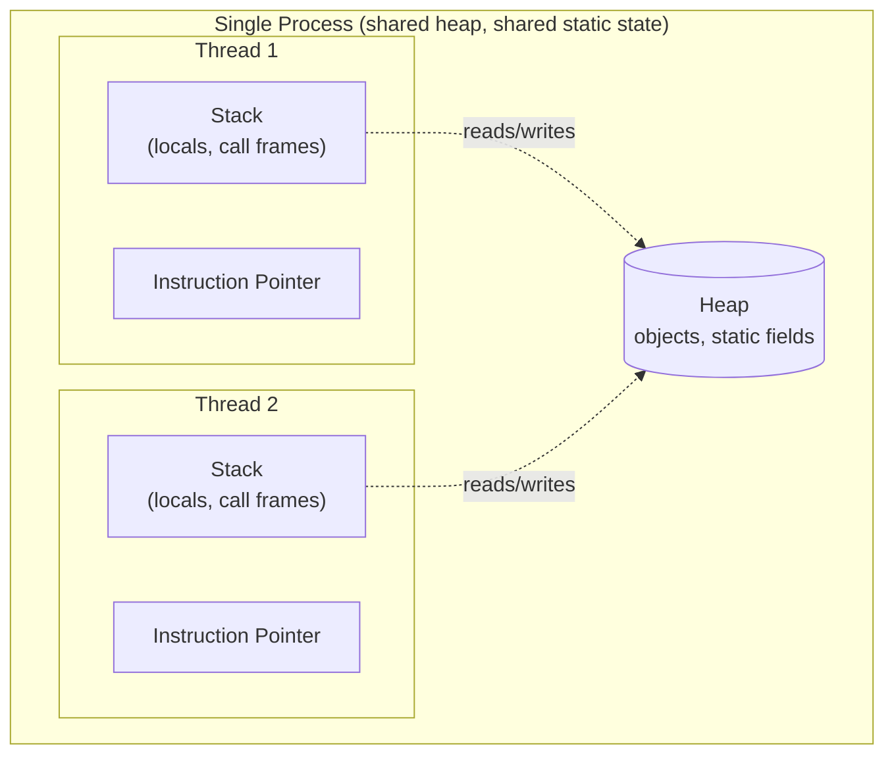

Each thread carries:

- **Stack** — the memory region where local variables live and where arguments are passed into/out of
  function calls. Private to the thread; nobody else can see it.
- **Instruction pointer** — the address of the next instruction that thread will execute.

`Stack + Instruction Pointer` together *are* the thread's execution state — that's exactly what a context
switch has to save and restore (see §3).

---

## 3. Context Switching

A context switch is the OS scheduler pausing one thread and resuming another on the same core.

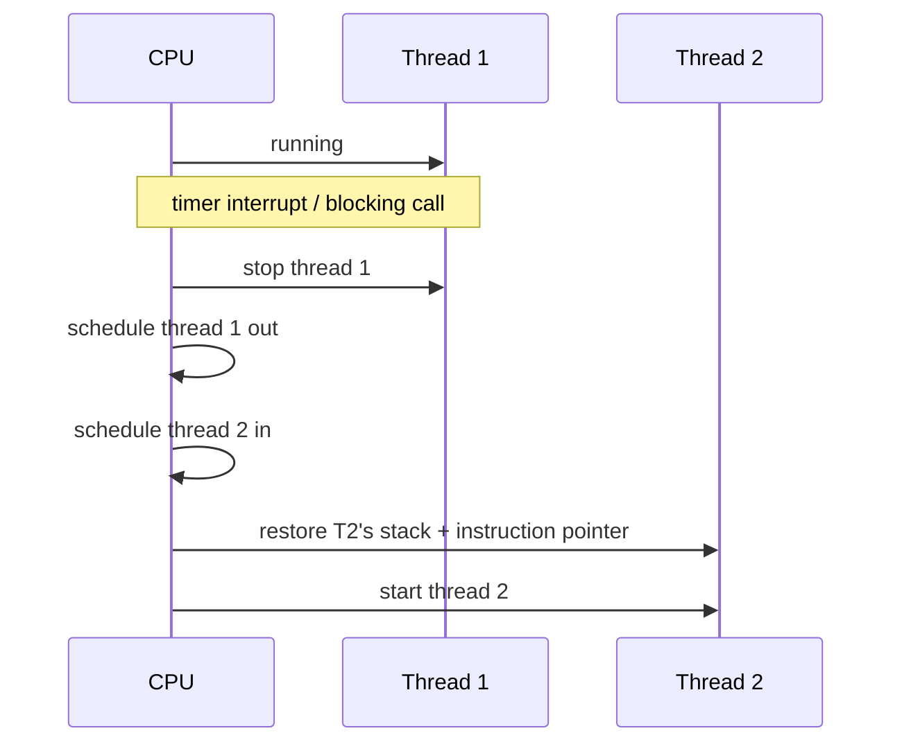

**Context switching is not free** — it's the price you pay for multitasking. Cost comes from:

- Saving/restoring registers, stack pointer, instruction pointer.
- Losing CPU cache locality (L1/L2 warmed up for the old thread, now cold for the new one).
- Kernel scheduler bookkeeping.

### Key takeaways

- **Thrashing**: too many runnable threads competing for too few cores means the CPU spends more time
  *switching* than doing real work.
- Threads are cheaper than processes: less memory overhead, faster to create/destroy, and switching between
  threads *of the same process* is cheaper than switching between processes (no address-space/TLB flush).
- **Prefer a multithreaded architecture when tasks share a lot of data** — that's exactly what threads are
  good at (shared heap) and what separate processes make expensive (IPC, serialization).

---

## 4. Creating Threads: `Runnable` vs. `Thread`

Every thread, regardless of how it was created, moves through the same lifecycle (`Thread.State` in the JDK):

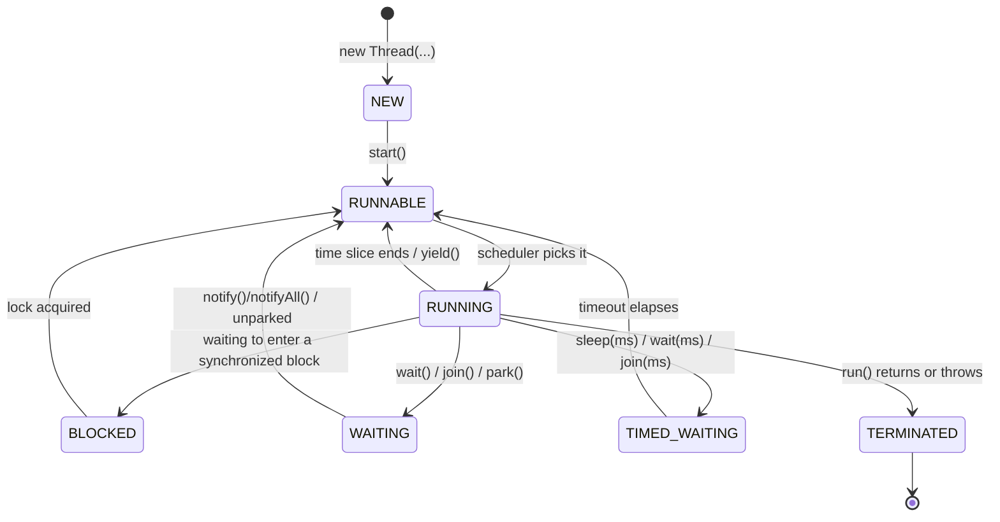

Two ways to define "what a thread runs," and they're not equivalent design choices:

```java
// 1. Implement Runnable — preferred: separates "the work" from "the execution mechanism"
class PrintTask implements Runnable {
    @Override
    public void run() {
        System.out.println("running on: " + Thread.currentThread().getName());
    }
}
Thread t1 = new Thread(new PrintTask(), "worker-1");
t1.start();               // schedules run() on a new thread — never call run() directly

// Lambda form (Runnable is a functional interface)
Thread t2 = new Thread(() -> System.out.println("hello from lambda"), "worker-2");
t2.start();

// 2. Extend Thread — couples the work to the thread itself; use only when you need to
// override other Thread behavior, not just for "I want to run some code"
class WorkerThread extends Thread {
    @Override
    public void run() {
        System.out.println("running on: " + getName());
    }
}
new WorkerThread().start();
```

`Runnable` is preferred because Java has single inheritance: extending `Thread` burns your one `extends` slot
and forces every task to also *be* a thread, which stops you from reusing the same task on an executor's
thread pool. `Runnable` decouples "what to run" from "what runs it."

---

## 5. Thread Termination and Interruption

**Why threads need to be cleaned up:** a live thread holds resources even when idle — memory, kernel-level
scheduling structures, CPU cache lines. If the thread has finished its logical work but the process is still
running, leaving it alive wastes those resources for nothing. The other reason to end a thread is that it's
**misbehaving** (stuck, runaway, or no longer needed).

**When can a thread be interrupted?**

1. It's executing a blocking method that declares `throws InterruptedException` (`Thread.sleep`,
   `Object.wait`, `BlockingQueue.take`, ...) — the interrupt unblocks it immediately as that exception.
2. Its own code explicitly checks and handles the interrupt flag.

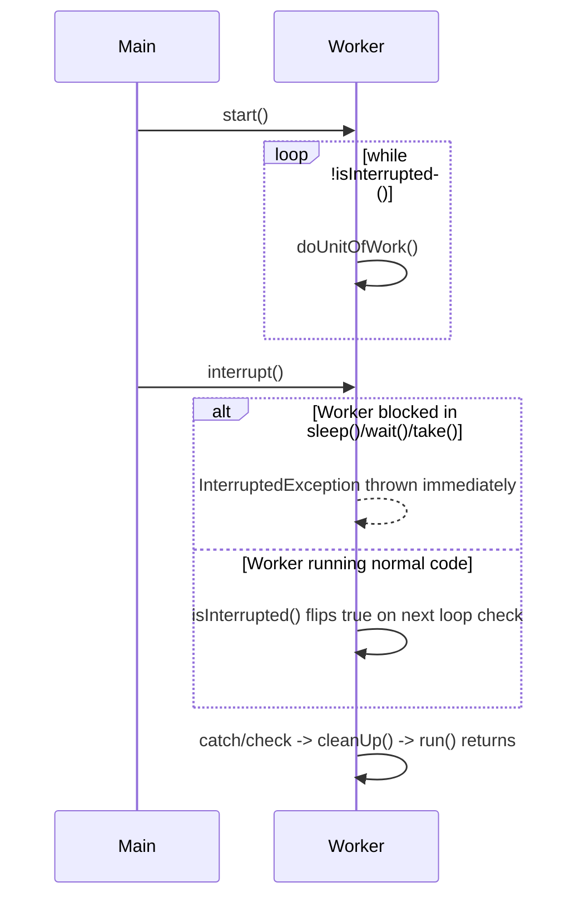

```java
Thread worker = new Thread(() -> {
    try {
        while (!Thread.currentThread().isInterrupted()) {
            doUnitOfWork();
        }
    } catch (InterruptedException e) {
        Thread.currentThread().interrupt(); // restore the flag — don't swallow it
    } finally {
        cleanUp();
    }
});
worker.start();
...
worker.interrupt();   // requests cooperative shutdown — does NOT force-kill the thread
```

`Thread.interrupt()` only *sets a flag* (or throws, if the thread is blocked in an interruptible call). It
never forcibly kills a thread — Java has no safe way to do that (the old `Thread.stop()` is deprecated because
it can release locks mid-invariant and corrupt shared state). Cooperative interruption is the only sane
mechanism.

---

## 6. Daemon Threads

**Daemon threads** are background threads that do **not** prevent the JVM from exiting once every
non-daemon (user) thread has finished. When the last user thread dies, the JVM exits immediately —
daemon threads are simply cut off mid-execution, no cleanup guaranteed.

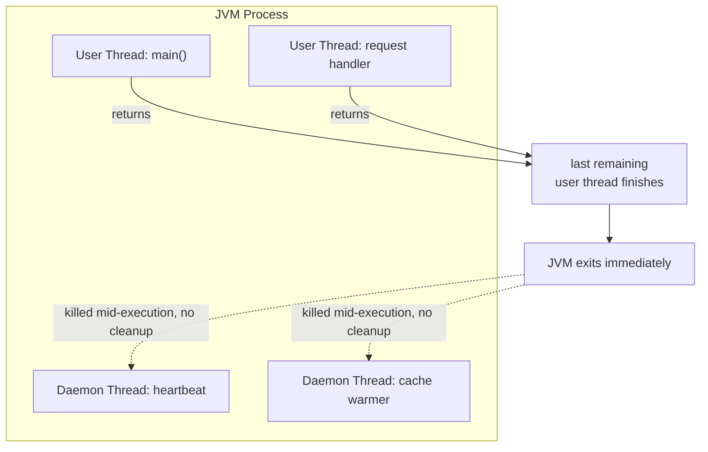

```java
Thread heartbeat = new Thread(() -> {
    while (true) {
        pingServer();
        sleepQuietly(5000);
    }
});
heartbeat.setDaemon(true);   // must be set BEFORE start()
heartbeat.start();
// main thread finishes -> JVM exits -> heartbeat is killed instantly, no matter what it was doing
```

**When to use daemon threads:**

1. **Pure background tasks** whose absence at shutdown is fine — you don't want them to block the
   application from terminating (metrics pings, cache-warming loops).
2. **Code you don't control running in a worker thread**, where you don't want its liveness to block your
   application's exit (e.g. a callback from a library you can't modify).

---

## 7. Thread Coordination: `join()`

By default, threads run **independently** and their relative order of execution is out of your control — the
scheduler decides. That's fine until one thread's result *depends* on another's completing first.

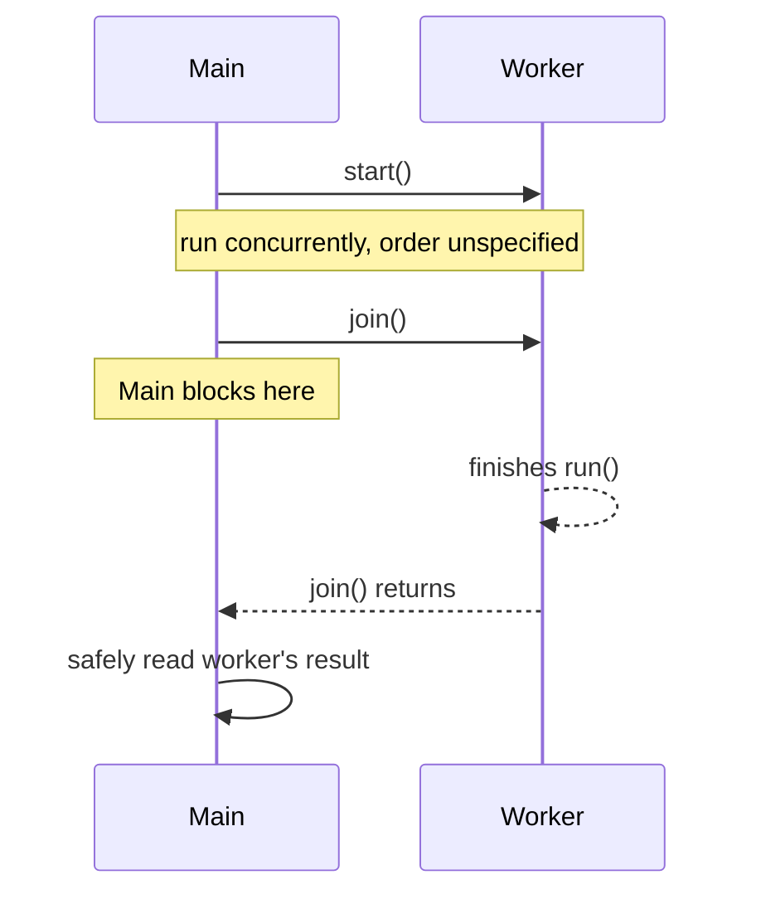

```java
Thread worker = new Thread(() -> result.set(computeExpensiveThing()));
worker.start();

worker.join();                 // block until worker finishes — gives a happens-before edge
System.out.println(result.get()); // now safe to read: worker's writes are guaranteed visible here

// Graceful handling of a possibly-runaway thread:
worker.join(2000);             // wait at most 2s
if (worker.isAlive()) {
    worker.interrupt();        // it didn't finish in time — ask it to stop
}
```

`join()` gives you:

- **More control over otherwise-independent threads** — a synchronization point.
- **Safe result collection** — `join()` establishes a happens-before edge, so writes the worker made before
  finishing are guaranteed visible to whoever successfully joined it.
- **Graceful handling of runaway threads** via the timeout overload, instead of blocking forever.

---

## 8. Performance: Latency vs. Throughput

Two different numbers — optimizing one can hurt the other, so know which one you're actually being asked for:

| Metric | Definition | Unit |
|---|---|---|
| **Latency** | Time for *one* task to complete | time (ms, s) |
| **Throughput** | Number of tasks completed in a given period | tasks / time unit |

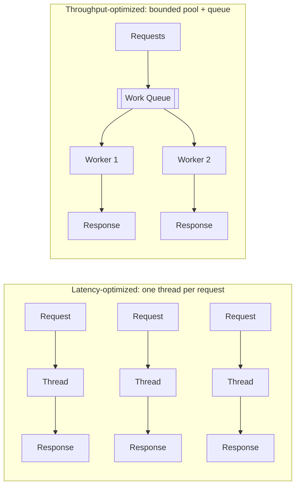

- A single fast dedicated thread per request → low latency, but throughput caps out fast under load.
- A bounded thread pool (see the executor framework in the companion doc) → trades a little latency (queueing)
  for much higher sustainable throughput.

`Thread Pooling`, `HyperThreading` (the CPU-level SMT technique that lets one physical core service two
hardware thread contexts to hide memory-stall latency) are the two "more depth here" pointers from the raw
notes — both are covered fully in
[`java-concurrency-and-thread-safety.md`](./java-concurrency-and-thread-safety.md#12-executors-and-thread-pools).

---

## 9. Memory Layout: Stack vs. Heap

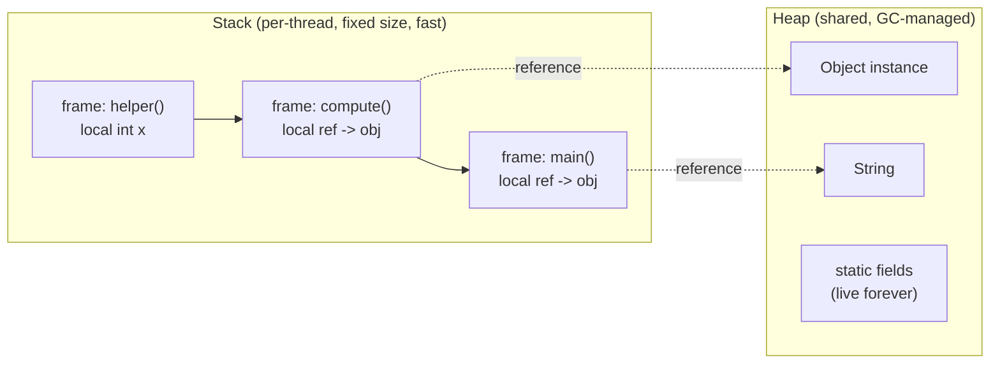

### Stack properties

- All variables on a stack belong to the thread executing on it — never shared.
- Statically allocated when the thread is created.
- Fixed, relatively small size (platform-specific).
- A call hierarchy that's too deep → `StackOverflowError`. This is the classic risk with unbounded or
  incorrect recursion.

### What lives on the heap

- Every **object** — anything created with `new` (`String`, custom objects, `Collection` instances, ...).
- **Members of classes** (instance fields) — same lifecycle as their parent object.
- **`static` variables** — live for the lifetime of the class, effectively "forever" (until classloader
  unload).
- Managed entirely by the **garbage collector**: an object survives as long as something reachable still
  references it.

### References vs. objects

```java
class Box {
    Integer value;        // reference — lives on the heap AS A MEMBER of this Box object
}

void method() {
    Box b = new Box();    // 'b' is a reference living on the STACK (it's a local variable)
                           // the Box object itself lives on the HEAP
    b.value = 42;          // 'value' reference lives on the heap, because it's a member of Box
}
```

- **References** can live on the stack (if they're locals) *or* on the heap (if they're members of an
  object).
- **Objects themselves are always on the heap** — this is why they're visible across threads (see §10) and
  why concurrent access to them needs coordination.

---

## 10. Resource Sharing Between Threads

Because the heap is shared, any of the following counts as a "resource" multiple threads might touch:

- Variables (`int`, `String`, ...)
- Data structures (lists, maps, queues)
- File or connection handles
- Message/work queues
- Any object reference reachable from more than one thread

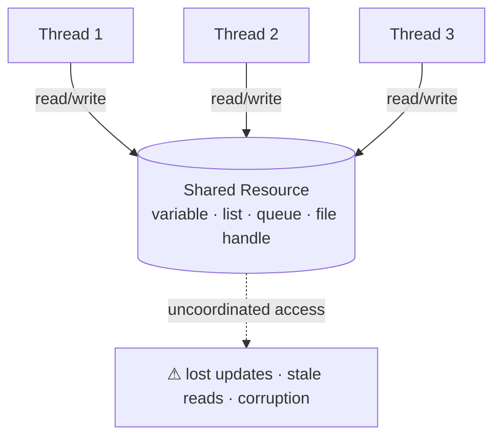

**The problem with sharing a resource:** once two threads can read *and* one of them can write the same
resource without coordination, you get the hazards covered in §11–§15 (lost updates, stale reads, races).

---

## 11. Atomic Operations

An operation (or set of operations) is **atomic** if it appears to the rest of the system as happening all at
once — single step, "all or nothing," no observable intermediate state.

```java
class Counter {
    private int count = 0;
    void increment() { count++; }   // NOT atomic: read, add, write — 3 separate steps
}
```

Two threads can both read `7`, both compute `8`, both write `8` — one increment is silently lost:

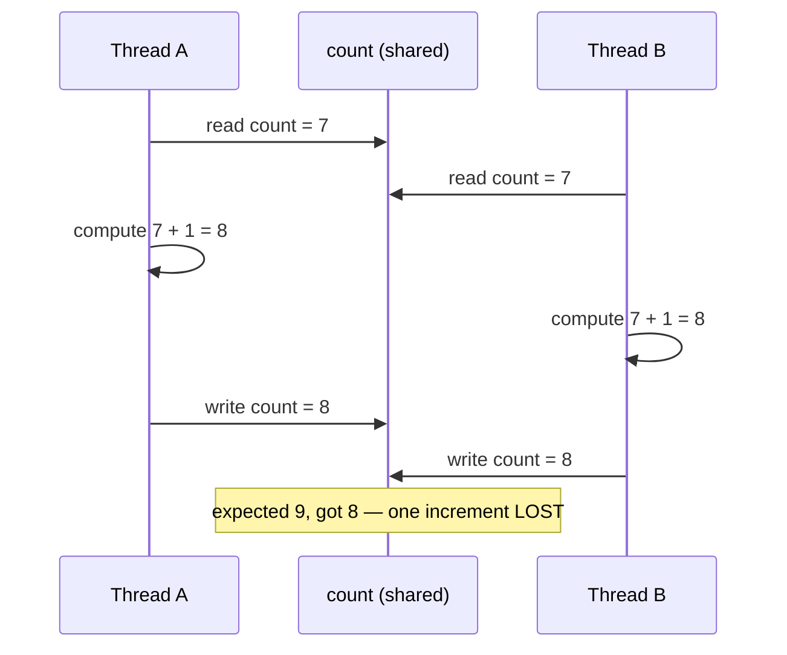

**What Java actually guarantees atomic, out of the box:**

- All **reference assignments** are atomic — you can get/set an object reference atomically.
- Assignments to all primitive types are atomic **except `long` and `double`** (they're 64-bit and can be
  written as two non-atomic 32-bit word writes on some JVMs/platforms).
- `long`/`double` assignments *do* become atomic if the field is declared `volatile`.

```java
private volatile long counter;   // now single reads/writes of `counter` are atomic (still NOT increment!)
```

`volatile` fixes atomicity of a single read-or-write of `long`/`double` — it does **not** make `counter++`
atomic, because that's still read-modify-write across multiple operations. For that you need `synchronized`
or `java.util.concurrent.atomic.AtomicLong`.

---

## 12. Critical Sections and `synchronized`

A **critical section** is a block of code that touches shared state and therefore must be executed by only
one thread at a time.

`synchronized` is Java's built-in locking mechanism (a **monitor lock**, one per object) used to restrict a
critical section — or an entire method — to a single thread at a time.

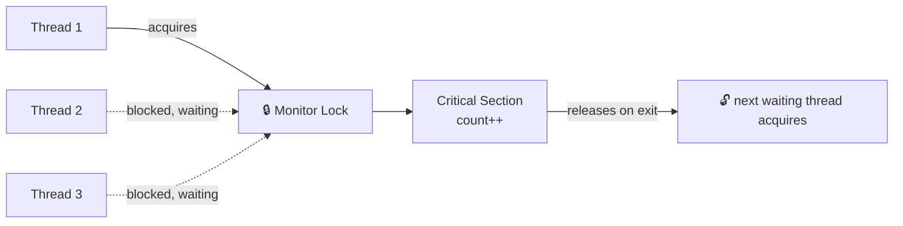

```java
class SafeCounter {
    private int count = 0;

    // Monitor form: synchronized keyword on the method — locks on 'this'.
    // Only one thread can be inside ANY synchronized instance method of this object at once.
    public synchronized void increment() {
        count++;
    }

    private final Object lockingObject = new Object();

    // Explicit lock-object form: locks on a chosen object, not 'this'.
    // Lets you scope the critical section tighter than "the whole method."
    public void incrementNarrow() {
        doUnrelatedWork();               // NOT protected — runs concurrently, fine
        synchronized (lockingObject) {
            count++;                     // only this bit needs mutual exclusion
        }
    }
}
```

Two important properties:

- **Reentrant**: if a thread already holds the lock, it can enter another `synchronized` block guarded by
  the *same* lock without blocking on itself.
- **A thread can never lock itself out** — reentrancy guarantees a thread can always re-enter a critical
  section it already holds the monitor for (e.g. a synchronized method calling another synchronized method on
  the same object).

```java
public synchronized void outer() {
    inner();   // fine — same thread, same lock, reentrant
}
public synchronized void inner() { /* ... */ }
```

---

## 13. Race Conditions vs. Data Races

These two terms get used interchangeably but describe distinct problems.

### Race condition

A **race condition** happens when multiple threads access a shared resource, **at least one is modifying
it**, and the *timing* of thread scheduling determines whether the result is correct. The root cause is
performing a **non-atomic (compound) operation** on the resource.

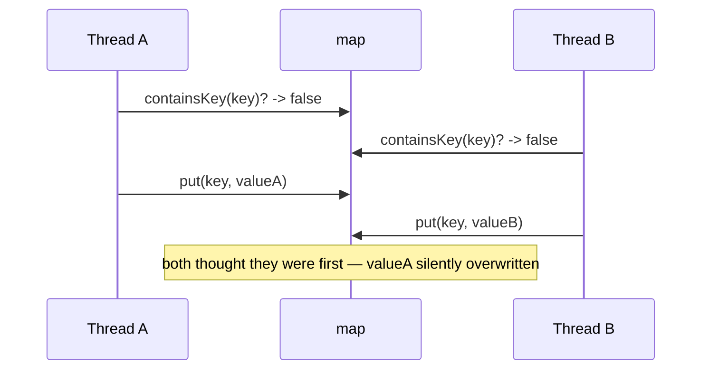

```java
// Classic check-then-act race
if (!map.containsKey(key)) {   // thread A and B can both pass this check
    map.put(key, value);       // both write — one "wins" unexpectedly, or a duplicate slips through
}
```

Fix: make the compound operation atomic (`synchronized`, or `map.putIfAbsent(key, value)`).

### Data race

A **data race** is a lower-level, memory-model phenomenon: the compiler and CPU are *allowed* to reorder
instructions to optimize performance and utilization (better branch prediction, SIMD vectorization,
prefetching, better hardware-unit usage) — as long as they preserve logical correctness **for a single
thread**. Across threads, with no synchronization telling the compiler/CPU "these two things must stay
ordered relative to each other," that reordering becomes visible and can produce paradoxical results.

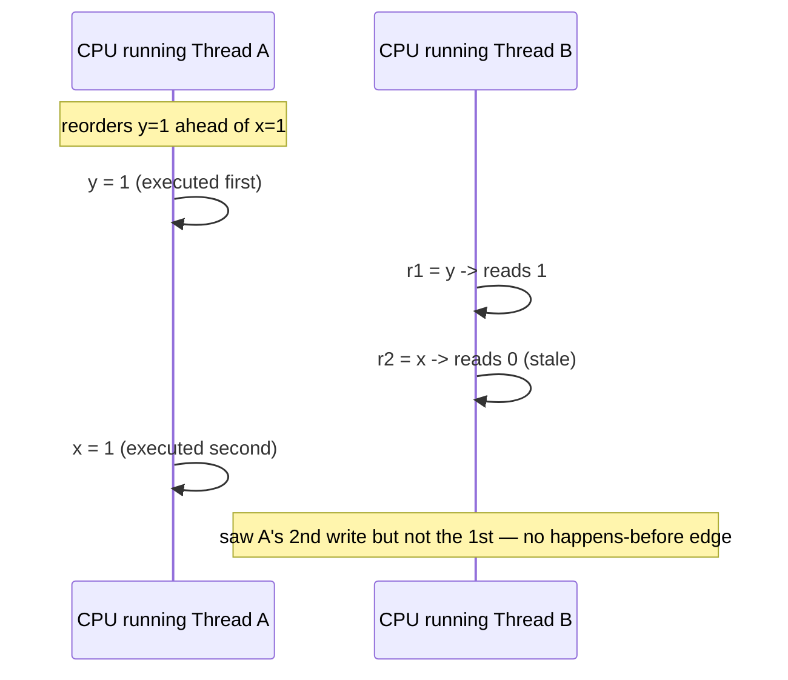

```java
// Thread A            // Thread B
x = 1;                 r1 = y;
y = 1;                 r2 = x;
// Legal outcome without synchronization: r1 == 1 && r2 == 0
// (B observed A's second write but not A's first — no happens-before edge exists)
```

**Data race consequences:** unexpected, paradoxical, and incorrect results that can be very hard to reproduce
— because they depend on JIT/CPU reordering decisions, not just thread scheduling.

**The fix — establish happens-before semantics**, via either of:

1. **Synchronize** the methods/blocks that modify the shared variable(s) (`synchronized`, locks).
2. **Declare the shared variable `volatile`** — this forbids the compiler/CPU from reordering around it and
   guarantees visibility of the write to any thread that subsequently reads it.

| | Race condition | Data race |
|---|---|---|
| Cause | Non-atomic compound operation on shared state | Missing happens-before edge; compiler/CPU reordering |
| Fixed by | Making the *operation* atomic (locks, atomic classes) | Making the *variable* visible/ordered (`volatile`, locks) |
| Can happen without the other? | Yes — a race condition can exist even with perfectly ordered memory | Yes — a data race can exist on a variable nothing else "races" logically on |

---

## 14. Locking Strategy: Fine-Grained vs. Coarse-Grained

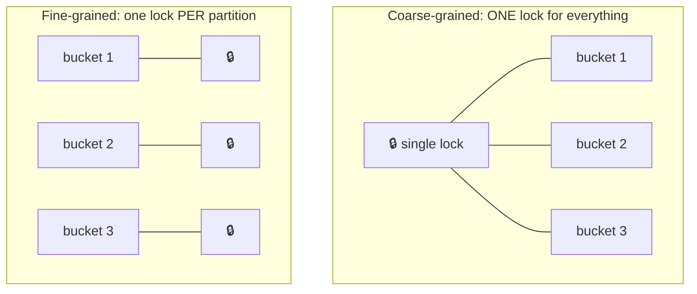

### Fine-grained locking

Many specific locks, each protecting a small, distinct part of a data structure, instead of one lock for the
whole thing.

```java
class ShardedCounter {
    private static final int SHARDS = 16;
    private final long[] counts = new long[SHARDS];
    private final Object[] locks = new Object[SHARDS];
    { for (int i = 0; i < SHARDS; i++) locks[i] = new Object(); }

    void increment(int key) {
        int shard = key % SHARDS;
        synchronized (locks[shard]) {   // only blocks other threads hitting the SAME shard
            counts[shard]++;
        }
    }
}
```

- **How it works:** high parallelism — threads touching *different* partitions (hash buckets, rows) run
  fully concurrently; contention only happens when two threads hit the *same* partition.
- **Pros:** true concurrent execution, much higher throughput under contention.
- **Cons:** more memory/CPU overhead managing many lock objects; materially higher risk of subtle bugs —
  especially deadlocks — if lock acquisition order across shards isn't disciplined.

### Coarse-grained locking

A single, large lock protects an entire data structure, a large segment of code, or a group of related
objects.

```java
class SimpleCounter {
    private final Object lock = new Object();
    private final long[] counts = new long[16];

    void increment(int key) {
        synchronized (lock) {          // blocks EVERY other increment(), regardless of key
            counts[key % counts.length]++;
        }
    }
}
```

- **How it works:** one lock guards multiple resources or a whole component (e.g. an entire hash table, or a
  customer record plus all its addresses).
- **Pros:** simple to design, implement, and reason about; minimal deadlock/race-condition risk since there's
  only one lock to track; low overhead (nothing to acquire/release except the one lock).
- **Cons:** reduced concurrency — threads block on the single lock even when working on fully independent
  parts of the structure; under high load this serializes what should be parallel work, turning a multi-core
  system into an effective single-threaded queue.

**Rule of thumb:** start coarse-grained (simplicity, correctness); move to fine-grained only once profiling
shows lock contention is the actual bottleneck.

---

## 15. Deadlocks

A **deadlock** is a condition where two or more threads are blocked forever, each waiting for a resource or
lock held by another.

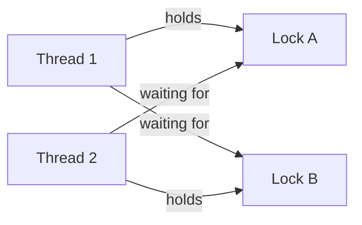

```java
Object lockA = new Object();
Object lockB = new Object();

// Thread 1
new Thread(() -> {
    synchronized (lockA) {
        sleep(50);              // give thread 2 time to grab lockB
        synchronized (lockB) {  // blocks: thread 2 holds lockB
            System.out.println("T1 done");
        }
    }
}).start();

// Thread 2 — acquires in the OPPOSITE order
new Thread(() -> {
    synchronized (lockB) {
        sleep(50);
        synchronized (lockA) {  // blocks: thread 1 holds lockA
            System.out.println("T2 done");
        }
    }
}).start();
// Neither thread ever finishes.
```

### The four conditions (all must hold simultaneously)

1. **Mutual exclusion** — only one thread can hold a given resource at a time.
2. **Hold and wait** — a thread holds at least one resource while waiting for another.
3. **Non-preemptive allocation** — a resource is only released voluntarily by the thread holding it, never
   forcibly taken away.
4. **Circular wait** — a cycle of ≥2 threads, each holding a resource the next one in the cycle is waiting
   for.

### Solution

Break any one of the four conditions and the deadlock becomes impossible. The cheapest one to break in
practice is **circular wait**: **enforce a strict, global lock-acquisition order** everywhere in the codebase.

```java
// Fix: both threads always acquire lockA before lockB, regardless of "logical" order
private static void transfer(Object from, Object to, Runnable work) {
    Object first  = System.identityHashCode(from) < System.identityHashCode(to) ? from : to;
    Object second = (first == from) ? to : from;
    synchronized (first) {
        synchronized (second) {
            work.run();
        }
    }
}
```

Ordering locks by a stable key (identity hash, an assigned lock ID, alphabetical resource name, ...) means no
two threads can ever be waiting on each other in a cycle.

---

## 16. Cheat Sheet

| Concept | One-line rule |
|---|---|
| `Runnable` vs `Thread` | Implement `Runnable`; only extend `Thread` if you need to override thread behavior itself |
| Interrupting | Cooperative only — check the flag or catch `InterruptedException`; never force-kill |
| Daemon thread | `setDaemon(true)` before `start()`; dies instantly, no cleanup, when last user thread exits |
| `join()` | Blocks caller until target finishes; gives a happens-before edge for reading its results |
| Stack | Per-thread, private, fixed size, holds locals + call frames — never shared |
| Heap | Shared, GC-managed, holds every object + static fields — where sharing hazards live |
| Atomic by default | Reference assignment; all primitives except `long`/`double` (those need `volatile` or an atomic class) |
| `synchronized` | Reentrant monitor lock; makes a section/method single-threaded-at-a-time |
| Race condition | Non-atomic compound op on shared state → fix by making the *operation* atomic |
| Data race | Missing happens-before edge, compiler/CPU reorders visibly → fix with `volatile`/locks |
| Coarse-grained lock | One lock, simple, low overhead, low concurrency |
| Fine-grained lock | Many locks, high concurrency, more overhead, higher deadlock risk |
| Deadlock | 4 conditions (mutual exclusion, hold-and-wait, non-preemption, circular wait) — break circular wait via lock ordering |

**Next:** [`java-concurrency-and-thread-safety.md`](./java-concurrency-and-thread-safety.md) for the memory
model deep-dive, `volatile`/CAS internals, explicit locks, synchronizers, executors, `CompletableFuture`,
virtual threads, and the production/interview playbook.
